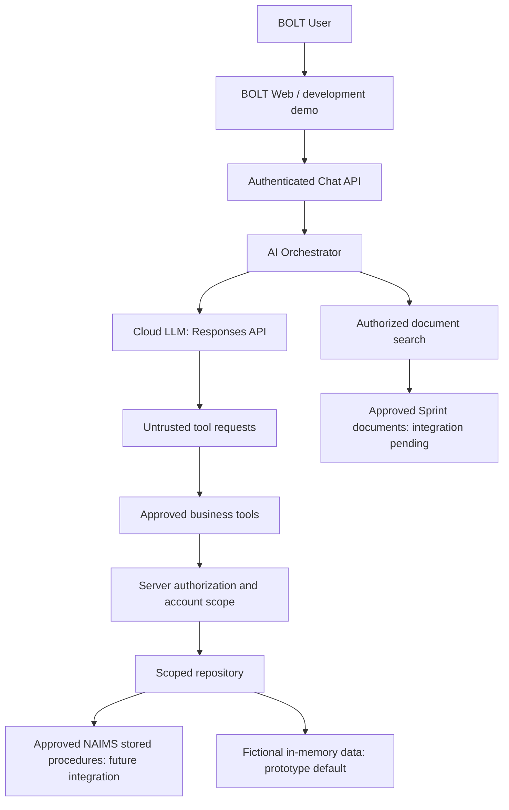

# BOLT AI prototype architecture

This standalone .NET 10 prototype is intended for future BOLT integration. One ASP.NET Core process hosts the chat API and a plain JavaScript demo; Domain, Application and Infrastructure remain separate assemblies.

No model has database access or credentials. Scoped lookups combine account authorization with resource retrieval; unknown and unauthorized resources have the same result. Product locations require an extra role. Tool schemas do not accept account IDs. Conversation history is bounded, expires, and is owned by user plus exact account/role scope. Model-generated output and document content are untrusted; the UI renders text only.

Development identity is explicit, opt-in, and server configured. The JWT adapter requires validated bearer tokens from a confirmed BOLT issuer and audience; no browser identity headers. The entire fictional-data prototype refuses non-Development startup until real integrations are approved. Mock AI uses deterministic routing and the same dispatcher as OpenAI. It does not represent a live LLM validation.

Implementation plan: (1) contracts, mocks and scope tests; (2) Responses adapter and bounded tool loop; (3) authenticated API, audit, timeouts and rate limits; (4) security/integration tests; (5) opt-in stored-procedure scaffold; (6) demo UI and runbook.

SQL procedure names and result contracts are integration placeholders, never guessed production schema. SQL remains disabled by default and no production connections are attempted.
